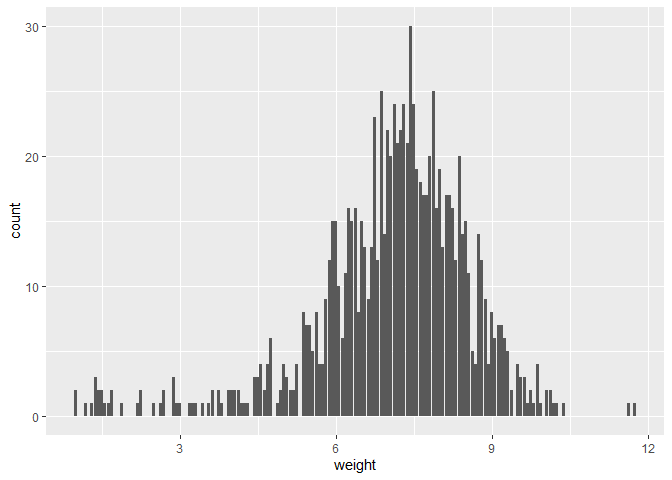
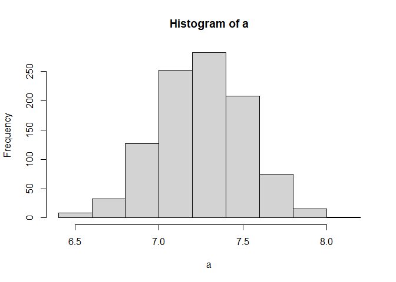
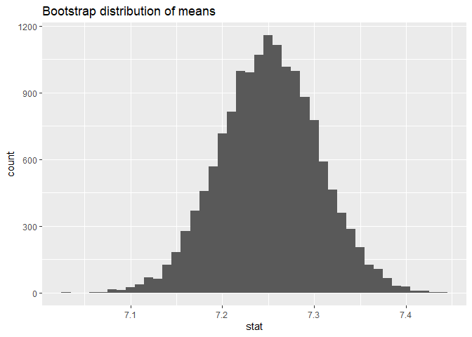
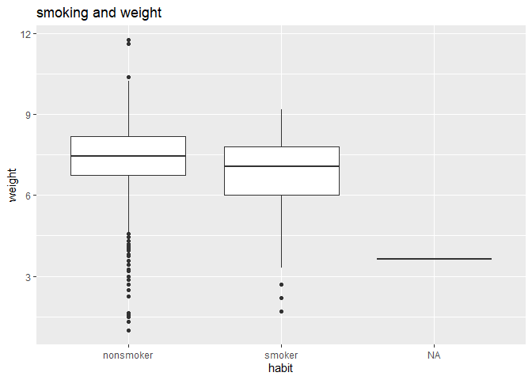

Lab 11 Lab: So what if you smoke when pregnant?
================
Zheqi
3/20

### Load packages and data

``` r
library(tidyverse) 
library(infer)
library(openintro)

#git config -- user.name "jessieeeee77"
#git config -- user.email "huz220@wfu.edu"
```

``` r
data(ncbirths)
glimpse(ncbirths)
```

    ## Rows: 1,000
    ## Columns: 13
    ## $ fage           <int> NA, NA, 19, 21, NA, NA, 18, 17, NA, 20, 30, NA, NA, NA,…
    ## $ mage           <int> 13, 14, 15, 15, 15, 15, 15, 15, 16, 16, 16, 16, 16, 16,…
    ## $ mature         <fct> younger mom, younger mom, younger mom, younger mom, you…
    ## $ weeks          <int> 39, 42, 37, 41, 39, 38, 37, 35, 38, 37, 45, 42, 40, 38,…
    ## $ premie         <fct> full term, full term, full term, full term, full term, …
    ## $ visits         <int> 10, 15, 11, 6, 9, 19, 12, 5, 9, 13, 9, 8, 4, 12, 15, 7,…
    ## $ marital        <fct> not married, not married, not married, not married, not…
    ## $ gained         <int> 38, 20, 38, 34, 27, 22, 76, 15, NA, 52, 28, 34, 12, 30,…
    ## $ weight         <dbl> 7.63, 7.88, 6.63, 8.00, 6.38, 5.38, 8.44, 4.69, 8.81, 6…
    ## $ lowbirthweight <fct> not low, not low, not low, not low, not low, low, not l…
    ## $ gender         <fct> male, male, female, male, female, male, male, male, mal…
    ## $ habit          <fct> nonsmoker, nonsmoker, nonsmoker, nonsmoker, nonsmoker, …
    ## $ whitemom       <fct> not white, not white, white, white, not white, not whit…

``` r
#100 cases, 13 variables
ggplot(ncbirths, aes(x=weight)) + 
  geom_bar()
```

<!-- -->

``` r
#does have outilers that are extreme.
```

``` r
ncbirths_white <- ncbirths %>%
  filter(whitemom %in% c("white"))

mean(ncbirths$weight)
```

    ## [1] 7.101

``` r
#7.101
```

``` r
ncbirths_white %>%
  count(weight)
```

    ## # A tibble: 117 × 2
    ##    weight     n
    ##     <dbl> <int>
    ##  1   1        1
    ##  2   1.31     1
    ##  3   1.5      1
    ##  4   1.56     1
    ##  5   1.63     1
    ##  6   1.69     1
    ##  7   2.19     1
    ##  8   2.25     2
    ##  9   2.5      1
    ## 10   2.69     2
    ## # … with 107 more rows

``` r
#looked at the data, it seems that the conditions necessary for simulating based on inference are satisfied.
```

``` r
boot <- ncbirths_white %>%
  slice_sample(n = 50, replace = TRUE)
mean(boot$weight)
```

    ## [1] 7.2438

``` r
sd(boot$weight)
```

    ## [1] 1.910825

``` r
# set a seed
set.seed(1234)
# take 1000 bootstrap samples
a = replicate(1000, mean(sample(boot$weight, 50, replace=TRUE)))
mean(a)
```

    ## [1] 7.251692

``` r
sd(a)
```

    ## [1] 0.260486

``` r
hist(a)
```

<!-- -->

``` r
ncbirths_white %>%
  specify(response = weight) %>% 
  generate(reps = 15000, type = "bootstrap") %>% 
  calculate(stat = "mean") %>%
  summarize(lower = quantile(stat, 0.025),
            upper = quantile(stat, 0.975))
```

    ## # A tibble: 1 × 2
    ##   lower upper
    ##   <dbl> <dbl>
    ## 1  7.14  7.35

``` r
boot2 <- ncbirths_white %>%
  # specify the variable of interest
  specify(response = weight) %>% 
  # generate 15000 bootstrap samples
  generate(reps = 15000, type = "bootstrap") %>% 
  # calculate the mean of each bootstrap sample
  calculate(stat = "mean")
ggplot(data = boot2, mapping = aes(x = stat)) +
  geom_histogram(binwidth = .01) +
  labs(title = "Bootstrap distribution of means")
```

<!-- -->

``` r
quantile(boot$stat, c(0.025, 0.975))
```

    ## Warning: Unknown or uninitialised column: `stat`.

    ##  2.5% 97.5% 
    ##    NA    NA

``` r
mean(boot2$stat > 7.43)
```

    ## [1] 6.666667e-05

``` r
#significant
```

``` r
ggplot(data = ncbirths_white, mapping = aes(x = habit, y=weight)) +
  geom_boxplot() +
  labs(title = "smoking and weight")
```

<!-- -->

``` r
na.omit(ncbirths_white$habit)
```

    ##   [1] nonsmoker nonsmoker nonsmoker nonsmoker nonsmoker nonsmoker nonsmoker
    ##   [8] smoker    smoker    smoker    nonsmoker nonsmoker nonsmoker nonsmoker
    ##  [15] smoker    nonsmoker nonsmoker nonsmoker nonsmoker nonsmoker nonsmoker
    ##  [22] nonsmoker nonsmoker nonsmoker nonsmoker nonsmoker nonsmoker nonsmoker
    ##  [29] nonsmoker nonsmoker smoker    smoker    smoker    smoker    nonsmoker
    ##  [36] nonsmoker nonsmoker nonsmoker smoker    nonsmoker nonsmoker nonsmoker
    ##  [43] nonsmoker nonsmoker nonsmoker nonsmoker nonsmoker nonsmoker nonsmoker
    ##  [50] nonsmoker nonsmoker smoker    smoker    nonsmoker nonsmoker nonsmoker
    ##  [57] nonsmoker nonsmoker nonsmoker nonsmoker nonsmoker nonsmoker nonsmoker
    ##  [64] nonsmoker nonsmoker nonsmoker nonsmoker nonsmoker nonsmoker nonsmoker
    ##  [71] nonsmoker nonsmoker nonsmoker nonsmoker nonsmoker nonsmoker nonsmoker
    ##  [78] nonsmoker nonsmoker nonsmoker nonsmoker nonsmoker nonsmoker nonsmoker
    ##  [85] nonsmoker smoker    smoker    smoker    smoker    smoker    smoker   
    ##  [92] smoker    smoker    smoker    smoker    nonsmoker nonsmoker nonsmoker
    ##  [99] nonsmoker nonsmoker nonsmoker nonsmoker nonsmoker nonsmoker nonsmoker
    ## [106] nonsmoker nonsmoker nonsmoker nonsmoker nonsmoker nonsmoker nonsmoker
    ## [113] nonsmoker nonsmoker nonsmoker nonsmoker nonsmoker nonsmoker nonsmoker
    ## [120] smoker    smoker    smoker    smoker    smoker    nonsmoker nonsmoker
    ## [127] nonsmoker nonsmoker nonsmoker nonsmoker smoker    nonsmoker nonsmoker
    ## [134] nonsmoker nonsmoker nonsmoker nonsmoker nonsmoker nonsmoker nonsmoker
    ## [141] nonsmoker nonsmoker nonsmoker nonsmoker nonsmoker nonsmoker nonsmoker
    ## [148] nonsmoker nonsmoker nonsmoker nonsmoker nonsmoker nonsmoker nonsmoker
    ## [155] nonsmoker nonsmoker nonsmoker nonsmoker nonsmoker nonsmoker nonsmoker
    ## [162] smoker    smoker    smoker    smoker    smoker    smoker    smoker   
    ## [169] smoker    smoker    smoker    smoker    nonsmoker nonsmoker nonsmoker
    ## [176] nonsmoker nonsmoker nonsmoker nonsmoker nonsmoker nonsmoker nonsmoker
    ## [183] nonsmoker nonsmoker nonsmoker nonsmoker nonsmoker nonsmoker nonsmoker
    ## [190] nonsmoker nonsmoker nonsmoker nonsmoker nonsmoker nonsmoker nonsmoker
    ## [197] smoker    smoker    nonsmoker nonsmoker nonsmoker nonsmoker nonsmoker
    ## [204] nonsmoker nonsmoker nonsmoker nonsmoker nonsmoker nonsmoker nonsmoker
    ## [211] nonsmoker nonsmoker nonsmoker nonsmoker nonsmoker nonsmoker nonsmoker
    ## [218] nonsmoker nonsmoker nonsmoker nonsmoker nonsmoker nonsmoker nonsmoker
    ## [225] nonsmoker nonsmoker nonsmoker nonsmoker nonsmoker smoker    smoker   
    ## [232] smoker    smoker    smoker    smoker    smoker    nonsmoker nonsmoker
    ## [239] nonsmoker nonsmoker nonsmoker nonsmoker nonsmoker nonsmoker nonsmoker
    ## [246] nonsmoker nonsmoker nonsmoker nonsmoker nonsmoker nonsmoker nonsmoker
    ## [253] nonsmoker nonsmoker nonsmoker nonsmoker nonsmoker nonsmoker nonsmoker
    ## [260] nonsmoker nonsmoker nonsmoker nonsmoker nonsmoker nonsmoker nonsmoker
    ## [267] nonsmoker nonsmoker nonsmoker nonsmoker nonsmoker nonsmoker nonsmoker
    ## [274] smoker    smoker    smoker    nonsmoker nonsmoker smoker    smoker   
    ## [281] nonsmoker nonsmoker nonsmoker nonsmoker nonsmoker nonsmoker nonsmoker
    ## [288] nonsmoker nonsmoker nonsmoker nonsmoker nonsmoker nonsmoker nonsmoker
    ## [295] nonsmoker nonsmoker nonsmoker nonsmoker nonsmoker nonsmoker nonsmoker
    ## [302] nonsmoker nonsmoker nonsmoker nonsmoker nonsmoker nonsmoker nonsmoker
    ## [309] nonsmoker nonsmoker nonsmoker smoker    smoker    smoker    smoker   
    ## [316] smoker    smoker    nonsmoker nonsmoker nonsmoker nonsmoker nonsmoker
    ## [323] nonsmoker nonsmoker nonsmoker nonsmoker nonsmoker nonsmoker nonsmoker
    ## [330] nonsmoker nonsmoker nonsmoker nonsmoker nonsmoker nonsmoker nonsmoker
    ## [337] nonsmoker nonsmoker nonsmoker nonsmoker nonsmoker nonsmoker nonsmoker
    ## [344] nonsmoker nonsmoker nonsmoker nonsmoker smoker    smoker    smoker   
    ## [351] smoker    smoker    smoker    nonsmoker nonsmoker nonsmoker smoker   
    ## [358] nonsmoker nonsmoker nonsmoker nonsmoker nonsmoker nonsmoker nonsmoker
    ## [365] nonsmoker nonsmoker nonsmoker nonsmoker nonsmoker nonsmoker nonsmoker
    ## [372] nonsmoker nonsmoker nonsmoker nonsmoker nonsmoker nonsmoker nonsmoker
    ## [379] nonsmoker nonsmoker nonsmoker nonsmoker nonsmoker nonsmoker smoker   
    ## [386] smoker    smoker    smoker    nonsmoker nonsmoker nonsmoker nonsmoker
    ## [393] nonsmoker smoker    smoker    nonsmoker nonsmoker nonsmoker nonsmoker
    ## [400] nonsmoker nonsmoker nonsmoker nonsmoker nonsmoker nonsmoker nonsmoker
    ## [407] nonsmoker nonsmoker nonsmoker nonsmoker nonsmoker nonsmoker nonsmoker
    ## [414] nonsmoker nonsmoker nonsmoker nonsmoker nonsmoker nonsmoker nonsmoker
    ## [421] nonsmoker nonsmoker nonsmoker nonsmoker nonsmoker nonsmoker smoker   
    ## [428] smoker    nonsmoker nonsmoker nonsmoker nonsmoker smoker    nonsmoker
    ## [435] nonsmoker nonsmoker nonsmoker nonsmoker nonsmoker nonsmoker nonsmoker
    ## [442] nonsmoker nonsmoker nonsmoker nonsmoker nonsmoker nonsmoker nonsmoker
    ## [449] nonsmoker nonsmoker nonsmoker nonsmoker nonsmoker smoker    smoker   
    ## [456] smoker    smoker    smoker    smoker    nonsmoker nonsmoker nonsmoker
    ## [463] nonsmoker nonsmoker smoker    nonsmoker nonsmoker nonsmoker nonsmoker
    ## [470] nonsmoker nonsmoker nonsmoker nonsmoker nonsmoker nonsmoker nonsmoker
    ## [477] nonsmoker nonsmoker nonsmoker nonsmoker nonsmoker nonsmoker nonsmoker
    ## [484] nonsmoker nonsmoker nonsmoker nonsmoker nonsmoker nonsmoker nonsmoker
    ## [491] nonsmoker nonsmoker nonsmoker nonsmoker nonsmoker nonsmoker nonsmoker
    ## [498] nonsmoker nonsmoker nonsmoker nonsmoker nonsmoker smoker    smoker   
    ## [505] smoker    nonsmoker nonsmoker nonsmoker smoker    smoker    nonsmoker
    ## [512] nonsmoker nonsmoker nonsmoker nonsmoker nonsmoker nonsmoker nonsmoker
    ## [519] nonsmoker nonsmoker nonsmoker nonsmoker nonsmoker nonsmoker nonsmoker
    ## [526] nonsmoker nonsmoker nonsmoker nonsmoker nonsmoker nonsmoker nonsmoker
    ## [533] nonsmoker nonsmoker nonsmoker nonsmoker nonsmoker nonsmoker nonsmoker
    ## [540] smoker    nonsmoker nonsmoker nonsmoker nonsmoker nonsmoker nonsmoker
    ## [547] nonsmoker nonsmoker nonsmoker nonsmoker nonsmoker nonsmoker nonsmoker
    ## [554] nonsmoker nonsmoker nonsmoker nonsmoker nonsmoker nonsmoker nonsmoker
    ## [561] nonsmoker nonsmoker nonsmoker nonsmoker nonsmoker nonsmoker nonsmoker
    ## [568] smoker    smoker    nonsmoker nonsmoker smoker    nonsmoker nonsmoker
    ## [575] nonsmoker nonsmoker nonsmoker nonsmoker nonsmoker nonsmoker nonsmoker
    ## [582] nonsmoker nonsmoker nonsmoker nonsmoker nonsmoker nonsmoker nonsmoker
    ## [589] nonsmoker nonsmoker nonsmoker nonsmoker nonsmoker nonsmoker nonsmoker
    ## [596] nonsmoker nonsmoker nonsmoker nonsmoker nonsmoker nonsmoker nonsmoker
    ## [603] nonsmoker nonsmoker nonsmoker nonsmoker nonsmoker nonsmoker nonsmoker
    ## [610] nonsmoker nonsmoker nonsmoker nonsmoker nonsmoker nonsmoker nonsmoker
    ## [617] nonsmoker nonsmoker nonsmoker nonsmoker nonsmoker nonsmoker nonsmoker
    ## [624] nonsmoker nonsmoker nonsmoker nonsmoker nonsmoker nonsmoker nonsmoker
    ## [631] nonsmoker nonsmoker nonsmoker nonsmoker smoker    smoker    nonsmoker
    ## [638] nonsmoker nonsmoker nonsmoker nonsmoker nonsmoker nonsmoker nonsmoker
    ## [645] nonsmoker nonsmoker nonsmoker nonsmoker nonsmoker nonsmoker nonsmoker
    ## [652] nonsmoker nonsmoker nonsmoker nonsmoker nonsmoker nonsmoker nonsmoker
    ## [659] nonsmoker nonsmoker nonsmoker nonsmoker smoker    nonsmoker nonsmoker
    ## [666] nonsmoker nonsmoker nonsmoker nonsmoker nonsmoker nonsmoker nonsmoker
    ## [673] nonsmoker nonsmoker nonsmoker nonsmoker nonsmoker nonsmoker nonsmoker
    ## [680] nonsmoker nonsmoker nonsmoker smoker    nonsmoker nonsmoker nonsmoker
    ## [687] nonsmoker nonsmoker nonsmoker nonsmoker nonsmoker nonsmoker nonsmoker
    ## [694] nonsmoker smoker    nonsmoker nonsmoker nonsmoker nonsmoker smoker   
    ## [701] nonsmoker nonsmoker nonsmoker nonsmoker nonsmoker nonsmoker nonsmoker
    ## [708] nonsmoker nonsmoker nonsmoker nonsmoker nonsmoker nonsmoker
    ## attr(,"na.action")
    ## [1] 708
    ## attr(,"class")
    ## [1] omit
    ## Levels: nonsmoker smoker

``` r
ncbirths_habitgiven <- ncbirths_white
```

``` r
ncbirths_habitgiven %>%
  group_by(habit) %>%
  summarise(mean_weight = mean(weight))
```

    ## # A tibble: 3 × 2
    ##   habit     mean_weight
    ##   <fct>           <dbl>
    ## 1 nonsmoker        7.32
    ## 2 smoker           6.81
    ## 3 <NA>             3.63

``` r
#H0: μ weight(smoker)=μ weight(nonsmoker)
#H1: μ weigth(smoker)≠ μ weight(nonsmoker)
```

``` r
#satisfied. Because bootstrapping can be used to simulate and the conditions are satisfied.
```

``` r
mean(ncbirths_habitgiven$weight[ncbirths_habitgiven$habit=="smoker"])
```

    ## [1] NA

``` r
mean(ncbirths_habitgiven$weight[ncbirths_habitgiven$habit=="nonsmoker"])
```

    ## [1] NA

``` r
with(ncbirths_habitgiven, tapply(weight, habit, mean))
```

    ## nonsmoker    smoker 
    ##  7.324457  6.812604

``` r
test.stat1 <-abs(mean(ncbirths_habitgiven$weight[ncbirths_habitgiven$habit=="smoker"])-mean(ncbirths_habitgiven$weight[ncbirths_habitgiven$habit=="nonsmoker"]))
test.stat1
```

    ## [1] NA

``` r
set.seed(1234)
n<-length(ncbirths_habitgiven$weight)
n
```

    ## [1] 714

``` r
B <-1000
variable <-ncbirths_habitgiven$weight
```

``` r
ncbirths_habitgiven %>%
  group_by(habit) %>%
  summarise(mean_weight = mean(weight))
```

    ## # A tibble: 3 × 2
    ##   habit     mean_weight
    ##   <fct>           <dbl>
    ## 1 nonsmoker        7.32
    ## 2 smoker           6.81
    ## 3 <NA>             3.63

``` r
stat.test <- ncbirths_habitgiven %>% 
  t_test(weight ~ habit) 
```

    ## Warning: The statistic is based on a difference or ratio; by default, for
    ## difference-based statistics, the explanatory variable is subtracted in the
    ## order "nonsmoker" - "smoker", or divided in the order "nonsmoker" / "smoker"
    ## for ratio-based statistics. To specify this order yourself, supply `order =
    ## c("nonsmoker", "smoker")`.

``` r
stat.test
```

    ## # A tibble: 1 × 7
    ##   statistic  t_df p_value alternative estimate lower_ci upper_ci
    ##       <dbl> <dbl>   <dbl> <chr>          <dbl>    <dbl>    <dbl>
    ## 1      3.17  123. 0.00191 two.sided      0.512    0.192    0.831

``` r
#significantly different
```

``` r
quantile(ncbirths_habitgiven$weight,c(0.025,0.975))
```

    ##  2.5% 97.5% 
    ## 3.539 9.560

``` r
meanDiff =function(ncbirths_habitgiven, weight){
    y <- tapply(ncbirths_habitgiven$weight[ncbirths_habitgiven$habit=="smoker"],
                ncbirths_habitgiven$weight[ncbirths_habitgiven$habit=="nonsmoker"], mean)
    y[1]-y[2]}
```

``` r
with(ncbirths_habitgiven, tapply(weight, habit, mean))
```

    ## nonsmoker    smoker 
    ##  7.324457  6.812604

``` r
diff(with(ncbirths_habitgiven,tapply(weight, habit, mean)))
```

    ##     smoker 
    ## -0.5118529

``` r
set.seed(1234)
n.s <- 20
n.n <- 20
B <- 10000
Boot.smkoer <- matrix(sample(ncbirths_habitgiven$weight[ncbirths_habitgiven$habit=="smoker"], size=B * n.s, replace = TRUE), ncol=B, nrow=n.s)
Boot.nonsmkoer <- matrix(sample(ncbirths_habitgiven$weight[ncbirths_habitgiven$habit=="nonsmoker"],size=B * n.n, replace = TRUE), ncol=B, nrow=n.s)
dim(Boot.nonsmkoer)
```

    ## [1]    20 10000

``` r
dim(Boot.nonsmkoer)
```

    ## [1]    20 10000

``` r
Boot.smkoer[1:5, 1:5]
```

    ##      [,1] [,2] [,3] [,4] [,5]
    ## [1,] 6.25 8.13 9.13 5.81 4.06
    ## [2,] 6.50 7.31 7.31 5.94 5.50
    ## [3,] 7.69 7.44 7.31 7.38 6.50
    ## [4,] 1.69 2.19 7.13 6.94 5.69
    ## [5,] 7.06 5.38 8.06 7.13 5.81

``` r
Boot.nonsmkoer[1:5, 1:5]
```

    ##      [,1] [,2] [,3] [,4]  [,5]
    ## [1,] 6.88 8.19 8.06 6.88  8.38
    ## [2,] 8.50 7.94 8.44 7.31  6.50
    ## [3,] 8.50 8.31 6.81 5.94  8.44
    ## [4,] 4.44 7.50 9.00 7.50  8.25
    ## [5,] 6.38 6.56 8.50 7.63 10.06

``` r
Boot.diff.in.means <-colMeans(Boot.smkoer) - colMeans(Boot.nonsmkoer)
length(Boot.diff.in.means)
```

    ## [1] 10000

``` r
quantile(Boot.diff.in.means, probs = 0.025, na.rm = TRUE)
```

    ##      2.5% 
    ## -1.412838

``` r
quantile(Boot.diff.in.means, probs = 0.975, na.rm = TRUE)
```

    ##  97.5% 
    ## 0.3735

``` r
#95% confident that the diff of baby weight between smoker and nonsmoker is between -1.412838 to .3735
#intervals contain 0, not statistically significant.
```

``` r
ncbirths_mature <- ncbirths %>%
  filter(mature %in% c("younger mom")) 
range(ncbirths_mature$mage, na.rm = FALSE)
```

    ## [1] 13 34

``` r
#the cutoff is 34. I split the file and then checked the age range of the younger mothers.
```

``` r
ncbirths %>%
  group_by(mature) %>%
  summarise(mean_weight = mean(weight))
```

    ## # A tibble: 2 × 2
    ##   mature      mean_weight
    ##   <fct>             <dbl>
    ## 1 mature mom         7.13
    ## 2 younger mom        7.10

``` r
#H0: μ weight(mature)=μ weight(younger)
#H1: μ weigth(mature)> μ weight(younger)
stat.test <- ncbirths %>% 
  t_test(weight ~ mature) 
```

    ## Warning: The statistic is based on a difference or ratio; by default, for
    ## difference-based statistics, the explanatory variable is subtracted in the
    ## order "mature mom" - "younger mom", or divided in the order "mature mom" /
    ## "younger mom" for ratio-based statistics. To specify this order yourself,
    ## supply `order = c("mature mom", "younger mom")`.

``` r
stat.test
```

    ## # A tibble: 1 × 7
    ##   statistic  t_df p_value alternative estimate lower_ci upper_ci
    ##       <dbl> <dbl>   <dbl> <chr>          <dbl>    <dbl>    <dbl>
    ## 1     0.186  166.   0.853 two.sided     0.0283   -0.273    0.329

``` r
#p-value=0.8527932, not significant.
```

``` r
with(ncbirths, tapply(weight, mature, mean))
```

    ##  mature mom younger mom 
    ##    7.125564    7.097232

``` r
diff(with(ncbirths,tapply(weight, mature, mean)))
```

    ## younger mom 
    ## -0.02833208

``` r
set.seed(1234)
n.y <- 20
n.m <- 20
B <- 10000
Boot.younger <- matrix(sample(ncbirths$weight[ncbirths$mature=="younger mom"], size=B * n.y, replace = TRUE), ncol=B, nrow=n.y)
Boot.mature <- matrix(sample(ncbirths$weight[ncbirths$mature=="mature mom"],size=B * n.m, replace = TRUE), ncol=B, nrow=n.m)
dim(Boot.younger)
```

    ## [1]    20 10000

``` r
dim(Boot.mature)
```

    ## [1]    20 10000

``` r
Boot.younger[1:5, 1:5]
```

    ##      [,1] [,2] [,3] [,4] [,5]
    ## [1,] 3.75 7.63 8.56 4.00 6.25
    ## [2,] 6.94 6.31 5.44 7.56 7.81
    ## [3,] 7.94 7.50 5.94 7.50 4.50
    ## [4,] 6.50 6.81 7.56 6.69 6.19
    ## [5,] 6.00 6.63 7.31 6.75 6.38

``` r
Boot.mature [1:5, 1:5]
```

    ##      [,1]  [,2] [,3] [,4] [,5]
    ## [1,] 7.06 10.13 8.44 6.38 8.50
    ## [2,] 9.88  7.69 6.63 7.06 7.50
    ## [3,] 7.19  6.25 8.44 8.75 7.06
    ## [4,] 8.25  5.69 8.13 7.69 7.56
    ## [5,] 5.13  7.56 5.94 5.50 7.00

``` r
Boot.diff <-colMeans(Boot.mature) - colMeans(Boot.younger)
length(Boot.diff)
```

    ## [1] 10000

``` r
quantile(Boot.diff, probs = 0.05, na.rm = TRUE)
```

    ##     5% 
    ## -0.787

``` r
quantile(Boot.diff, probs = 0.95, na.rm = TRUE)
```

    ##   95% 
    ## 0.843

``` r
#include zero, not significantly different in means of weight.
```

…

Add exercise headings as needed.
